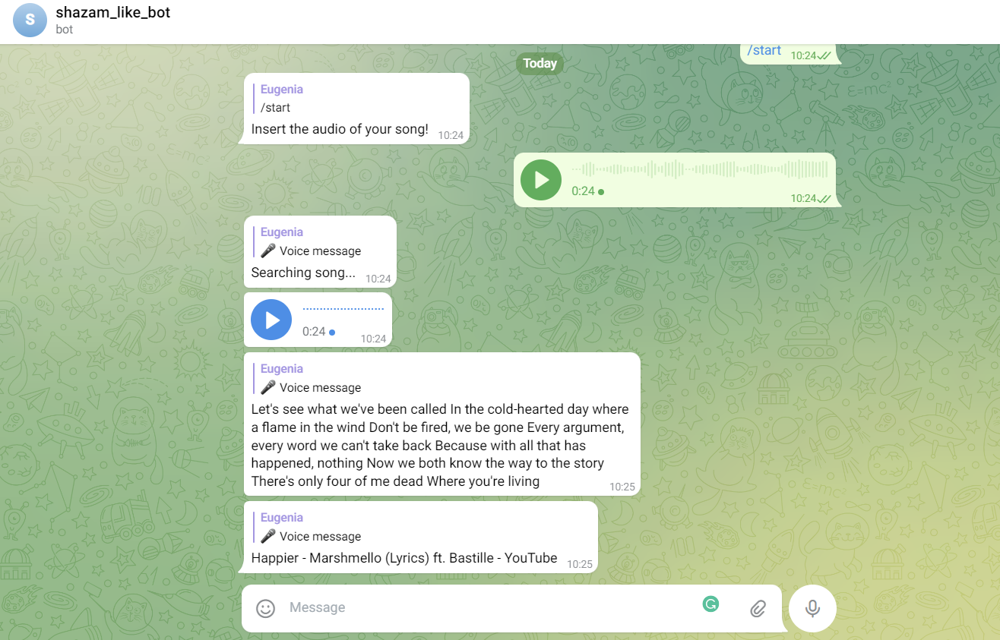

# Shazam-like Telegram Bot



In this project, we are going to create and deploy a telegram bot that transcribes the registration and discovers the information behind the song

## Detailed description of the project

The article with the explanations is [How to build a Shazam-like Telegram Bot using Python](https://towardsdatascience.com/how-to-build-a-shazam-like-telegram-bot-using-python-98dc081c53d5?sk=ab629aad0f5fe7810027cdce5ee4165b)

## Tools used in the project

* [pyTelegramBotAPI](https://pypi.org/project/pyTelegramBotAPI/)
* [Steamship](https://www.steamship.com/)
* [SerpApi](https://serpapi.com/)

## Project Structure

* ```bot.py```: python script to create the telegram bot
* ```requirements.txt```: contains the python libraries required
*  ```Dockerfile```: contains all the commands a user could call on the command line
*  ```cred.json```: contains credentials, but it's not used in the deployment
